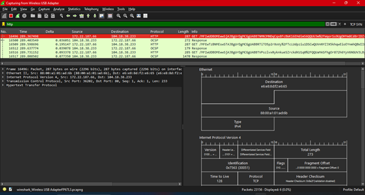
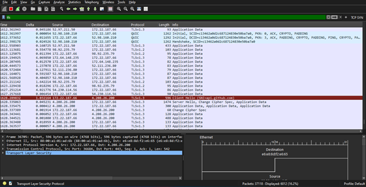
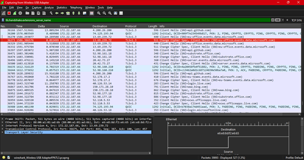

# HTTP vs HTTPS Analysis – Wireshark

## Objective
To analyze differences between HTTP and HTTPS traffic and understand visibility of data in encrypted vs unencrypted communication.

---

## Setup
- Tool: Wireshark
- Capture interface: Wi-Fi Adapter
- Filters used:
  - `http`
  - `tls`
  - `tls.handshake.extensions_server_name`

---

## HTTP Traffic Analysis

### Observation
- HTTP traffic was captured on port 80.
- Full request details were visible including:
  - Request method (GET)
  - URL path
  - Encoded parameters

### Example
- Observed GET request with long encoded string in URL.

### Security Insight
- HTTP traffic is **unencrypted**
- Data can be:
  - Intercepted
  - Read
  - Modified by attackers

---

## HTTPS / TLS Traffic Analysis

### Observation
- TLSv1.2 and TLSv1.3 traffic observed
- Only handshake and metadata visible
- Application data appears as encrypted payload

### Key Finding
- No readable content in HTTPS packets
- Payload is fully encrypted

---

## SNI (Server Name Indication) Analysis

### Observation
Using filter:
- tls.handshake.extensions_server_name

## Observed domains:
- api.github.com
- login.live.com
- www.bing.com
- microsoft services domains

### Explanation
- SNI reveals the intended domain during TLS handshake
- Visible even when traffic is encrypted

---

## QUIC Protocol Observation

- QUIC traffic observed (UDP-based)
- Used by modern applications (HTTP/3)
- Provides faster encrypted communication

---

## Security Relevance

Even though HTTPS encrypts content, analysts can still observe:
- Destination IP
- Domain name (via SNI)
- Traffic patterns
- Protocol behavior

This enables detection of suspicious activity without decrypting payload.

---

## Conclusion

- HTTP exposes full communication and is insecure
- HTTPS encrypts data but still leaks metadata
- SNI plays a key role in identifying domains in encrypted traffic
- Network monitoring relies heavily on metadata analysis

## Wireshark Evidence

### HTTP Traffic

### TLS Traffic

### SNI Analysis

